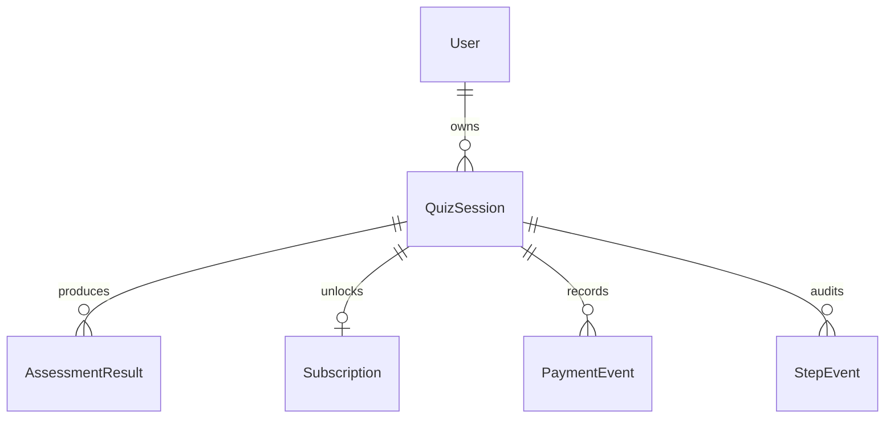

# HealthGate


HealthGate 是一个健康测评 funnel 全栈挑战项目，重点展示分步持久化、服务端健康评估、订阅鉴权、模拟支付闭环和自动化测试。

> 当前状态：核心实现、测试、CI workflow、生产维护 workflow 已完成。公网 Live URL 与 demo sessionId 待 Vercel/Supabase 部署后补入。

## Live Demo

- Live URL：待部署后补入
- GitHub Repo：https://github.com/77652189/healthGate
- UNPAID_DEMO_SESSION_ID：待 `seed-demo` 后补入
- PAID_DEMO_SESSION_ID：待 `seed-demo` 后补入

## Reviewer Quick Path

1. 打开 Live URL。
2. 完成 8 步健康测评。
3. 查看未支付 preview。
4. 点击“模拟支付并解锁”。
5. 查看 full result。

API 复现路径：

```bash
BASE_URL="https://<vercel-domain>"

curl -X POST "$BASE_URL/api/sessions" \
  -H "Content-Type: application/json" \
  -d '{"flowTopic":"healthgate_weight_management_v1","resumeExisting":false}'

SESSION_ID="<created-session-id>"

curl -X PATCH "$BASE_URL/api/sessions/$SESSION_ID/steps/profile" \
  -H "Content-Type: application/json" \
  -d '{"expectedVersion":1,"answers":{"gender":"female","ageRange":"30_39","currentBodyShape":"mid_sized"}}'

curl -X PATCH "$BASE_URL/api/sessions/$SESSION_ID/steps/goal" \
  -H "Content-Type: application/json" \
  -d '{"expectedVersion":2,"answers":{"goalType":"lose_weight","bodyZones":["belly","legs"],"desiredBodyShape":"toned"}}'

curl -X PATCH "$BASE_URL/api/sessions/$SESSION_ID/steps/body" \
  -H "Content-Type: application/json" \
  -d '{"expectedVersion":3,"answers":{"age":32,"heightCm":168,"currentWeightKg":74,"targetWeightKg":65,"healthDataConsent":true}}'

curl -X PATCH "$BASE_URL/api/sessions/$SESSION_ID/steps/activity" \
  -H "Content-Type: application/json" \
  -d '{"expectedVersion":4,"answers":{"activityLevel":"moderate","exerciseFrequency":"3_4_week","typicalDay":"active_breaks"}}'

curl -X PATCH "$BASE_URL/api/sessions/$SESSION_ID/steps/habits" \
  -H "Content-Type: application/json" \
  -d '{"expectedVersion":5,"answers":{"sleepHours":"7_8","waterIntake":"medium","dietPreference":"traditional","physicalLimitations":[]}}'

curl -X POST "$BASE_URL/api/sessions/$SESSION_ID/submit" \
  -H "Content-Type: application/json" \
  -d '{"expectedVersion":6}'

curl "$BASE_URL/api/sessions/$SESSION_ID/result"

curl -X POST "$BASE_URL/pay" \
  -H "Content-Type: application/json" \
  -d '{"sessionId":"'$SESSION_ID'","idempotencyKey":"review-demo-001","status":"succeeded"}'

curl "$BASE_URL/api/sessions/$SESSION_ID/result"
```

支付前 result 返回 `access=preview`，不包含受保护字段；`/pay` 后同一 session 返回 `access=full`。

## Tech Stack

- Next.js App Router + TypeScript
- Prisma + Supabase PostgreSQL
- Zod
- Vitest
- Playwright
- GitHub Actions
- Vercel

## Architecture Summary

```txt
Browser -> Next.js Pages -> Route Handlers -> Domain Services -> Prisma -> PostgreSQL
```

模块边界：

- `quiz`：session、分步保存、恢复、乐观锁。
- `assessment`：BMI、BMR/TDEE、摄入建议、目标日期、结果持久化。
- `access`：preview/full 字段裁剪。
- `payment`：`/pay` 幂等、payment event、subscription 激活。

## Data Model



核心字段列化，扩展问卷答案进入 `answersJson`；计算结果保留 `sourceSessionVersion` 和 `algorithmVersion`；订阅权限独立于问卷答案。

## API Quick Reference

| Method | Path | Purpose |
| --- | --- | --- |
| POST | `/api/sessions` | create-or-resume anonymous session |
| GET | `/api/sessions/:sessionId` | restore progress |
| PATCH | `/api/sessions/:sessionId/steps/:stepKey` | save incremental step answers |
| POST | `/api/sessions/:sessionId/submit` | generate persisted assessment |
| GET | `/api/sessions/:sessionId/result` | return preview/full result |
| POST | `/pay` | mock payment callback |
| GET | `/api/health` | API + DB readiness check |

统一错误结构：

```json
{
  "error": {
    "code": "VALIDATION_ERROR",
    "message": "Invalid request payload.",
    "details": []
  }
}
```

## Local Setup

```bash
npm ci
cp .env.example .env
npm run prisma:generate
npx prisma migrate dev
npm run dev
```

访问：

```txt
http://localhost:3000
```

## Environment Variables

```txt
DATABASE_URL=
DIRECT_URL=
NEXT_PUBLIC_APP_URL=
```

Vercel runtime 使用 Supabase pooled connection；Prisma migration 使用 direct connection。

## Test & Quality

```bash
npm run typecheck
npm test
npm run test:e2e
npm run test:ci
```

本次实现已覆盖：

- 算法单元测试：正常减重/维持/增重、BMI/BMR/TDEE、目标日期、projection curve。
- validation 边界：身高、体重、年龄、目标体重、非法数值、字符串数字、未知字段、跨 step 字段、原型污染、非法枚举。
- persistence 集成测试：create/resume、分步保存、子集保存、乱序、重复、并发 `VERSION_CONFLICT`、恢复。
- access 测试：preview/full 差异化、preview 递归扫描确认不泄漏 protected fields。
- payment 测试：`/pay` succeeded/failed、幂等重放、幂等冲突、先支付后 submit。
- E2E：完整 funnel -> preview -> `/pay` -> full，中途刷新恢复。

本地集成/E2E 需要 PostgreSQL。CI 使用 PostgreSQL service，不连接 production Supabase。

本次暂不覆盖：

- 真实支付网关。
- 用户注册登录。
- 医学级诊断准确性。
- 长期订阅续费/退款。
- 动态问卷 CMS。
- 像素级视觉回归。

## Deployment

- Web/API：Vercel。
- Database：Supabase PostgreSQL。
- CI：`.github/workflows/ci.yml`。
- Production migration/demo seed：手动触发 `.github/workflows/production-maintenance.yml`。

生产维护 workflow 需要 GitHub `production` environment secrets：

```txt
PRODUCTION_DATABASE_URL=
PRODUCTION_DIRECT_URL=
PRODUCTION_APP_URL=
```

部署后执行：

```txt
operation=migrate
operation=seed-demo
```

`seed-demo` 会输出：

```txt
UNPAID_DEMO_SESSION_ID=00000000-0000-4000-8000-000000000001
PAID_DEMO_SESSION_ID=00000000-0000-4000-8000-000000000002
```

## Documentation

- [竞品调研](./docs/competitor-research.md)
- [架构设计](./docs/architecture.md)
- [API 设计](./docs/api-design.md)
- [数据库设计](./docs/database-design.md)
- [前端 Funnel 体验设计](./docs/frontend-funnel-design.md)
- [公网部署策略](./docs/deployment-strategy.md)
- [自动化测试策略](./docs/testing-strategy.md)
- [测试要求可追踪矩阵](./docs/test-requirements-traceability.md)
- [AI 协作复盘](./docs/ai-collaboration-review.md)
- [实现路线图](./docs/implementation-roadmap.md)

