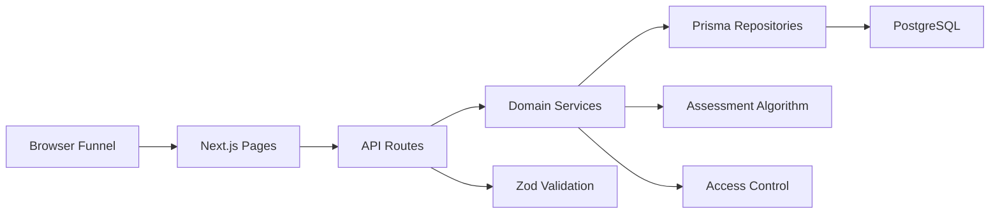
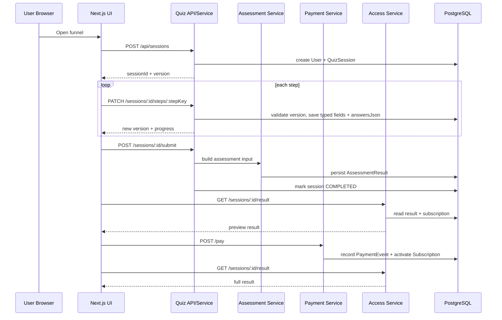
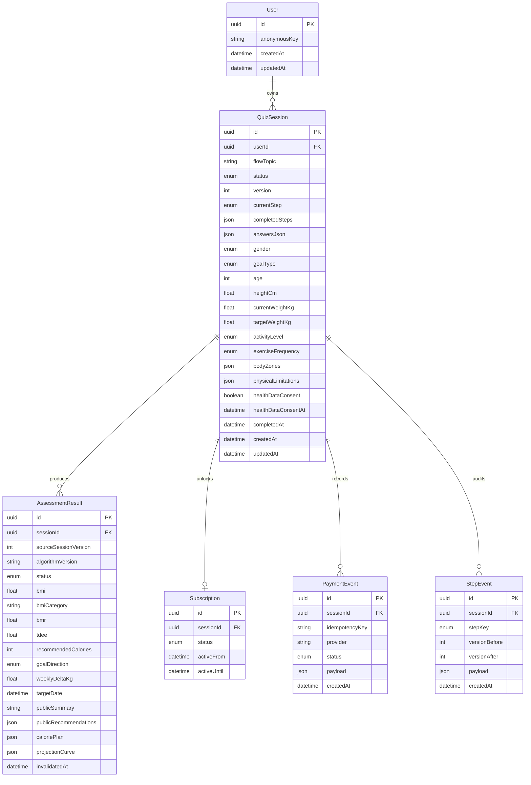
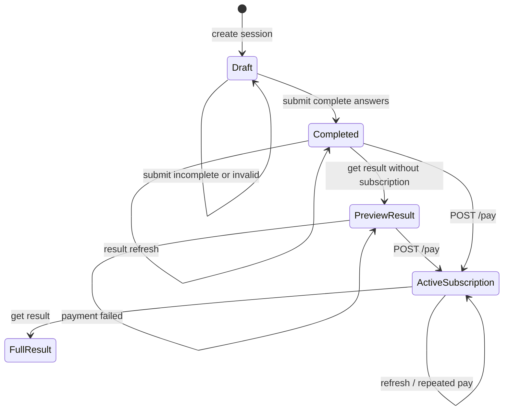
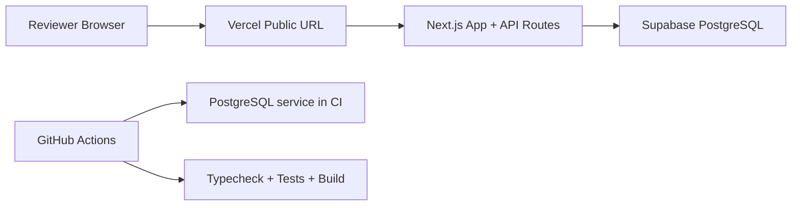

# HealthGate 架构设计

## 目标

HealthGate 是一个健康测评系统的全栈挑战项目。核心目标不是复刻 BetterMe 的全部商业 funnel，而是交付一个站得住的工程骨架：

- 用户可以匿名进入测评 funnel。
- 每一步答案都能保存到后端。
- 用户中断后可以恢复进度。
- 提交完整数据后由服务端计算健康评估结果。
- 结果页根据订阅状态返回脱敏或完整数据。
- `/pay` 模拟支付回调，形成权限闭环。
- 自动化测试覆盖核心逻辑、边界、异常和端到端流程。

## 非目标

- 不做真实支付。
- 不做医学诊断。
- 不做复杂账号体系。
- 不做像素级竞品复刻。
- 不做完整动态问卷 CMS。

## 推荐技术栈

| 层 | 技术 | 原因 |
| --- | --- | --- |
| Web/App | Next.js App Router + TypeScript | 前后端统一项目，部署和演示成本低 |
| API | Next.js Route Handlers | 足够支撑挑战范围，便于和页面共享类型 |
| 校验 | Zod | API 输入边界清楚，测试非法输入方便 |
| ORM | Prisma | Schema 可读，迁移和类型安全适合展示 DB 能力 |
| DB | Supabase PostgreSQL + Prisma | 题目明确点名 Supabase；Prisma 保留 schema、migration 和类型安全能力 |
| 单元/集成测试 | Vitest | TypeScript 项目轻量快速 |
| E2E | Playwright（可选少量） | 验证 funnel -> pay -> full result |
| CI | GitHub Actions | README 可以贴通过状态 |

## 前端形态决策

前端采用 **单页分步 funnel + 独立结果页**：

- `/` 承载 8 个视觉步骤的测评 funnel。
- `/result?sessionId=...` 承载结果页和 paywall。
- `POST /pay` 由结果页触发，用于模拟支付并刷新完整结果。

这个选择来自竞品调研，而不是单纯为了实现简单：

- 竞品使用 `order=<uuid>` 贯穿 questionnaire，HealthGate 对应使用匿名 `sessionId`。
- 竞品先收集目标、体型、习惯等低压力答案，再进入身高体重等敏感数据，HealthGate 因此不做短表单。
- 竞品有 `answers.required` 与 `extra/contentAnswers` 的分离，HealthGate 前端也按“核心计算字段”和“个性化展示字段”组织 step。
- 本题评分重点仍是后端、数据建模、恢复和测试，所以不采用多路由复杂问卷或营销页优先方案。

详细交互见 [前端 Funnel 体验设计](./frontend-funnel-design.md)。

## 总体架构



代码组织采用“模块化单体”：按业务能力聚合代码，每个模块内部再做轻量分层。

```txt
app/
  api/                         HTTP entrypoints, call module services only
  page.tsx                     funnel UI
  result/                      result page
src/
  modules/
    quiz/
      schemas.ts               step payload validation
      types.ts                 quiz/session types
      service.ts               create, restore, save step, submit orchestration
      repository.ts            Prisma-backed quiz persistence
    assessment/
      schemas.ts               assessment input validation
      types.ts
      service.ts               result generation and persistence
      algorithm.ts             pure BMI/BMR/TDEE/target-date logic
      repository.ts
    access/
      service.ts               result field-level access control
      protected-fields.ts
    payment/
      schemas.ts
      service.ts               mock pay, idempotency, subscription activation
      repository.ts
  shared/
    api-response.ts
    errors.ts
    prisma.ts
    time.ts
prisma/
  schema.prisma
docs/
  competitor-research.md
  architecture.md
  api-design.md
  database-design.md
  frontend-funnel-design.md
  deployment-strategy.md
  readme-delivery-structure.md
  acceptance-and-test-plan.md
  testing-strategy.md
  test-requirements-traceability.md
  ai-collaboration-review.md
  implementation-roadmap.md
```

原则：

- Route Handler 只负责 HTTP 输入输出。
- Module service 承载用例编排，不直接写 HTTP 细节。
- Algorithm 和 access control 保持纯函数，方便单元测试。
- Repository 隐藏 Prisma 细节，避免业务逻辑散落在 route handler。
- `quiz` 不计算健康结果，`assessment` 不判断付费权限，`payment` 不修改问卷答案。

### 模块职责

| 模块 | 负责 | 不负责 |
| --- | --- | --- |
| `quiz` | session 创建、恢复、step 保存、version 冲突、submit 完整性检查 | BMI/TDEE 算法、订阅权限 |
| `assessment` | 输入校验、算法计算、结果持久化、算法版本 | HTTP 响应裁剪、支付状态 |
| `access` | 根据 subscription 裁剪 result 字段 | 重新计算结果、修改订阅 |
| `payment` | `/pay`、payment event、幂等、激活 subscription | 修改 answers、重算 result |
| `shared` | 错误、响应、Prisma client、时间工具 | 业务规则 |

这种组织方式比纯技术分层更适合当前业务：一次需求通常围绕“测评流程”“评估结果”“支付解锁”纵向变化，而不是单独变化所有 repository 或所有 service。

### 完整业务流程



## 数据模型

### 从竞品数据流到 HealthGate 数据分类

竞品调研显示，funnel 中的数据不是同一种性质：

- 画像/动机数据：年龄段、当前体型、理想体型、体重变化倾向、生活事件。
- 计算必需数据：精确年龄、身高、当前体重、目标体重、活动水平。
- 安全/约束数据：健康数据同意、身体限制、目标体重合理性。
- 派生结果数据：BMI、BMR/TDEE、建议摄入量、目标日期、预测曲线。
- 支付/权限数据：订单/支付状态、订阅是否有效。

HealthGate 因此采用五类持久化边界：

| 数据类别 | 示例 | 持久化位置 | 原因 |
| --- | --- | --- | --- |
| Session 元数据 | flowTopic、currentStep、version、completedSteps | `quiz_sessions` | 支撑恢复、并发控制和状态机 |
| 核心计算字段 | gender、goalType、age、heightCm、currentWeightKg、targetWeightKg、activityLevel | `quiz_sessions` 强类型列 | 支撑校验、查询和算法输入 |
| 扩展答案 | 当前体型、目标体型、睡眠、饮水、饮食偏好、动机 | `quiz_sessions.answersJson` | 问卷可扩展，不频繁迁移 schema |
| 派生结果 | bmi、tdee、targetDate、caloriePlan、projectionCurve | `assessment_results` | 结果可审计，避免每次请求重算 |
| 权限/支付 | payment event、subscription status | `payment_events`、`subscriptions` | 权限来源与问卷答案分离 |

核心判断：

```txt
answersJson 不是垃圾桶，只放不会直接决定核心算法的扩展答案；
核心算法输入必须列化；
付费权限不放在 answersJson，也不放在 result 里，而由 subscriptions 决定。
```

### ER 图



### 为什么不是纯 JSON？

选项 A：所有答案都放 JSON。

- 优点：快，扩展问题简单。
- 缺点：数据库层很难表达关键字段约束；测试和查询都不够清楚。

选项 B：所有问题都建独立列。

- 优点：强类型。
- 缺点：funnel 一加题就迁移，挑战项目里显得僵硬。

选项 C：核心列 + answers JSON。

- 优点：关键计算字段稳定，扩展问题灵活。
- 缺点：需要明确哪些字段是核心。

推荐：C。

竞品也呈现类似结构：`answers.required` 承载核心字段，`extra/contentAnswers` 承载扩展字段。

这不是为了少建表，而是为了保留两种能力：

- 后端评分关心的稳定字段必须有强约束。
- 产品 funnel 中容易变化的题目必须能低成本扩展。

### 哪些字段进入算法

第一版算法只使用这些字段：

| 字段 | 来源步骤 | 用途 |
| --- | --- | --- |
| `gender` | profile | BMR 估算 |
| `goalType` | goal | 判断减重/增重/维持方向 |
| `age` | body | BMR 和安全边界 |
| `heightCm` | body | BMI |
| `currentWeightKg` | body | BMI、目标差值 |
| `targetWeightKg` | body | 目标日期和计划方向 |
| `activityLevel` | activity | TDEE activity factor |
| `exerciseFrequency` | activity | 结果页解释和计划建议 |
| `healthDataConsent` | body | submit 前置条件 |

这些字段之外的数据可以影响文案，但不影响第一版核心计算。这样可以避免把商业 funnel 的所有答案都伪装成“医学算法输入”。

`assessment_results.algorithmVersion` 和 `sourceSessionVersion` 必须持久化。原因是评估结果属于派生数据，后续如果调整活动系数、热量缺口或目标日期算法，历史结果仍然需要能解释“当时是按哪一版算法、哪一版问卷输入生成的”。

`assessment_results` 采用一对多历史模型，而不是 `sessionId` 唯一的一对一模型：

- 同一个 session 每次核心字段变化并重新 submit，可以产生新 result。
- 当前有效 result 用 `status=CURRENT` 表示。
- 核心字段修改后，旧 result 标记为 `STALE` 并写入 `invalidatedAt`。
- `@@unique([sessionId, sourceSessionVersion])` 保证同一 session version 的重复 submit 返回同一个 result。

这比直接覆盖 result 更利于审计，也更能解释自动化测试里的 result stale 路径。第一版在 service transaction 中保证每个 session 只有一个 current result。

## 状态机



### 状态说明

| 状态 | 含义 |
| --- | --- |
| `DRAFT` | 已创建 session，答案未完整 |
| `COMPLETED` | 已通过完整性校验并生成评估结果 |
| `SUBSCRIPTION_ACTIVE` | 订阅有效，结果接口可返回完整字段 |

订阅不是 `QuizSession.status` 的一部分，而是单独的 `subscriptions.status`。原因是测评完成和付费状态是两个不同维度。

### 刷新、中断和异常路径

| 场景 | 后端处理 | 前端体验 |
| --- | --- | --- |
| 首次打开 | `POST /api/sessions` create-or-resume session，设置 cookie，返回 sessionId | 进入第一步或恢复现有进度 |
| 页面刷新 | URL 有 sessionId 时调用 `GET /api/sessions/:id`；URL 没有时调用 `POST /api/sessions` 由后端根据 HttpOnly cookie 恢复 | 恢复到对应视觉步骤 |
| 中途关闭后再次进入 | 同刷新逻辑，后端返回 completedSteps 和 answers | 继续未完成步骤 |
| 已完成 session 再次打开首页 | 恢复 session 后发现 `status=COMPLETED` 且 result 有效 | 直接跳转结果页 |
| 用户返回修改旧步骤 | 允许 PATCH 任意 step，version +1 | 修改答案后后续结果需重新 submit |
| 乱序提交 | 保存允许，但不自动完成 session | submit 时提示缺失字段 |
| 旧版本并发提交 | 返回 `409 VERSION_CONFLICT`，session 不变 | 前端重新拉取最新进度 |
| step 输入非法 | 返回 `400 VALIDATION_ERROR`，session 不变 | 当前步骤展示错误 |
| submit 字段不完整 | 返回 `422 INCOMPLETE_SESSION`，status 仍 `DRAFT` | 跳回缺失步骤 |
| submit 算法校验失败 | 返回 `422 VALIDATION_ERROR`，不创建 result | 展示目标不合理原因 |
| result 未生成 | 返回 `409 RESULT_NOT_READY` | 引导重新 submit |
| 未支付 result | 返回 preview，不包含受保护字段 | 展示 paywall |
| 支付失败 | 记录 failed payment event，不激活 subscription | 仍展示 preview |
| 支付成功后刷新 | subscription 为 active，result 返回 full | 完整结果可重复查看 |

### 结果失效策略

如果 `COMPLETED` session 的核心字段被再次修改：

- session 状态回到 `DRAFT`。
- 旧 `assessment_result` 标记为过期或被新 submit 覆盖。
- 重新 submit 前，结果页请求返回 `RESULT_NOT_READY`；重新 submit 后才返回最新有效 result。

第一版实现可以选择“重新 submit 时 upsert 覆盖 result”，但文档和测试要明确：修改核心输入后不能继续使用旧结果。

## 并发与幂等

### Step 保存

采用 `version + expectedVersion`：

```txt
PATCH /api/sessions/:id/steps/:stepKey
```

客户端提交：

```json
{
  "expectedVersion": 3,
  "answers": {}
}
```

如果数据库当前版本不是 3，返回：

```txt
409 Conflict
```

这样可以显式覆盖并发更新测试。

### 重复提交

同一步重复提交允许，但会更新答案和版本，并记录 `StepEvent`。

理由：

- 用户可能返回修改答案。
- 前端重试不能造成不可恢复错误。

第一版采用简单规则：只要 PATCH 被接受，就递增 version。这样比“相同 payload 不递增”更容易解释和测试，也能完整记录用户操作历史。

### 乱序提交

保存阶段允许乱序；提交计算阶段严格校验完整性。

理由：

- 恢复页面、浏览器刷新、用户返回修改都可能导致非线性操作。
- 真正影响结果的是 submit，不是 step 顺序。

### 支付幂等

`/pay` 必须支持 `idempotencyKey`：

| 场景 | 处理 |
| --- | --- |
| 首次成功支付 | 创建 `PaymentEvent(SUCCEEDED)`，upsert `Subscription(ACTIVE)` |
| 同 key、同 session、同 status 重放 | 返回已有 payment event 和 active subscription |
| 同 key、不同 session 或不同 status | 返回 `409 IDEMPOTENCY_CONFLICT` |
| failed payment | 记录 failed event，不激活 subscription |

支付成功只改变访问权限，不修改 questionnaire answers，也不重新计算 assessment result。`/pay` 可以在 result 生成前调用；这时 subscription 会先激活，但结果接口仍按 `RESULT_NOT_READY` 处理，直到 session 完整 submit。

## 健康评估算法

算法定位：产品演示级健康估算，不构成医学建议。

输入：

- gender
- goalType
- age
- heightCm
- currentWeightKg
- targetWeightKg
- activityLevel
- exerciseFrequency
- healthDataConsent

输出：

- BMI
- BMI category
- BMR
- TDEE
- recommendedCalories
- goalDirection
- weeklyDeltaKg
- targetDate
- caloriePlan
- projectionCurve

建议公式：

- BMI：`weightKg / heightM^2`
- BMR：Mifflin-St Jeor
- TDEE：`BMR * activityFactor`
- 减重热量：`max(minCalories, TDEE - 500)`
- 增重热量：`TDEE + 250`
- 目标日期：基于安全周变化量估算

## 结果访问控制

结果接口根据 subscription 返回差异化响应。

非会员：

```json
{
  "access": "preview",
  "result": {
    "bmi": 26.1,
    "bmiCategory": "overweight",
    "publicSummary": "...",
    "publicRecommendations": []
  },
  "paywall": {
    "required": true,
    "message": "订阅后可查看完整计划。",
    "ctaLabel": "解锁完整计划",
    "features": [
      "目标日期与趋势",
      "每日摄入建议",
      "个性化饮食与运动计划"
    ]
  }
}
```

会员：

```json
{
  "access": "full",
  "result": {
    "bmi": 26.1,
    "bmiCategory": "overweight",
    "publicSummary": "...",
    "publicRecommendations": [],
    "bmr": 1450,
    "tdee": 1994,
    "recommendedCalories": 1494,
    "targetDate": "2026-09-02T00:00:00.000Z",
    "caloriePlan": {},
    "projectionCurve": []
  }
}
```

关键测试点：

非会员响应里不应该出现受保护字段，而不是只返回 `null`。

### 受保护字段边界

订阅前可返回：

- `bmi`
- `bmiCategory`
- `publicSummary`
- `publicRecommendations`
- `paywall.message`
- `paywall.ctaLabel`
- `paywall.features`

订阅前绝不能返回：

- `bmr`
- `tdee`
- `recommendedCalories`
- `goalDirection`
- `weeklyDeltaKg`
- `targetDate`
- `caloriePlan`
- `projectionCurve`

订阅后可返回完整字段。

会员响应是 preview 的超集：公开摘要和公开建议仍然保留，再追加受保护字段。

这个边界来自两部分：

- 竞品调研显示问卷、订单/支付状态分离，付费后才进入完整计划体验。
- 挑战题明确要求“非会员部分脱敏、会员完整返回”。

`paywall.features` 可以描述用户会解锁的能力，但不能包含原始字段 key 或具体受保护数值。

## 扩展性设计

| 未来变化 | 应修改的位置 | 不应修改的位置 |
| --- | --- | --- |
| 新增一个展示型问题 | `quiz/schemas.ts`、前端 step config、`answersJson.extra` 映射 | DB 核心列、assessment algorithm |
| 新增一个核心算法字段 | Prisma schema、`quiz` typed mapping、`assessment/schemas.ts`、算法和测试 | payment/access 模块 |
| 调整 BMI/TDEE 算法 | `assessment/algorithm.ts`，递增 `algorithmVersion` | quiz/payment/access |
| 新增受保护结果字段 | `assessment` result schema、`access/protected-fields.ts`、权限测试 | quiz step 保存 |
| 新增支付 provider | `payment` 模块和 `PaymentEvent.provider` | quiz/assessment |
| 新增登录用户体系 | `User` 和 session 绑定策略 | assessment algorithm |

单一职责边界：

- 问卷扩展不应该导致支付模块改动。
- 支付方式变化不应该导致算法改动。
- 算法变化不应该导致 step 保存接口改动，除非新增核心输入字段。
- 权限裁剪变化必须通过 `access` 模块和测试体现，而不是在前端隐藏字段。

## 公网部署架构

推荐组合：

- Vercel：部署 Next.js 页面和 API routes。
- Supabase PostgreSQL：托管数据库。
- Prisma：schema、migration 和类型安全访问层。
- GitHub Actions：运行 `npm ci`、Prisma generate/migrate、`npm run typecheck`、`npm test`、`npm run build`、E2E smoke。

选型理由：

- 技术要求明确写到 Supabase / Prisma + PostgreSQL，主选 Supabase 可以降低评审解释成本。
- Supabase 提供 PostgreSQL，满足关系建模、迁移和线上演示需求。
- Prisma 负责 schema、migration、类型安全查询和可审计的数据库变更。
- Neon 作为 Prisma + PostgreSQL 技术上可行，但不作为主选，避免评审对题意产生歧义。

### 部署拓扑



### 环境变量

线上至少需要：

```txt
DATABASE_URL=postgresql://...
DIRECT_URL=postgresql://...
NEXT_PUBLIC_APP_URL=https://<vercel-domain>
```

Supabase 连接策略：

- `DATABASE_URL` 可使用 pooled connection。
- `DIRECT_URL` 用 direct connection，供 Prisma migrate 使用。
- 如果 Supabase pooler 与 Prisma prepared statements 有兼容要求，在连接串中按 Supabase/Prisma 官方建议配置 pooler 参数。

### 数据库迁移策略

推荐部署流程：

```txt
local dev -> prisma migrate dev
CI -> postgres service + prisma migrate deploy + tests
production release -> prisma migrate deploy
```

Vercel build 不应隐式创建 migration。迁移脚本必须随仓库提交。

### 演示数据策略

交付物要求提供：

- 一个未支付 sessionId，用于观察 preview。
- 一个已支付 sessionId，用于观察 full result。

建议增加 seed 脚本：

```txt
npm run seed:demo
```

seed 创建：

- `demo-unpaid-session`
- `demo-paid-session`
- 对应 assessment result
- paid session 的 active subscription

这样评审即使不走完整 funnel，也能直接对比权限差异。

### 公网演示风险与处理

| 风险 | 处理 |
| --- | --- |
| Vercel serverless 冷启动 | API 保持轻量，算法本地纯计算 |
| Prisma 连接数过多 | 使用 Supabase pooled connection，migration 使用 direct URL |
| 迁移未执行 | README 写明 `prisma migrate deploy`，CI/build 检查 Prisma generate |
| 评审无法复现支付 | README 提供 `/pay` cURL 和 demo sessionId |
| cookie 在跨设备不可用 | URL 和 README 均支持显式 `sessionId` |
| 线上错误难排查 | 提供 `/api/health`，API 错误结构统一 |
| 数据库被演示污染 | demo session 可重复 seed；支付接口幂等 |

### 部署验收

上线后必须验证：

1. 打开公网 URL 可以从第一步走到结果页。
2. 刷新页面后进度仍可恢复。
3. 未支付结果页只显示 preview。
4. README 中 `/pay` cURL 可在公网 URL 上重放。
5. 支付后同一 session 返回 full result。
6. GitHub Actions 最新一次测试通过。

## 已定产品实现口径

1. 结果页和 funnel 文案使用中文主体验，README 可补充英文摘要。
2. 第一版接受匿名 session，不做登录注册。
3. 前端 funnel 控制为 8 个视觉步骤，底层映射到 5 个 API step。
