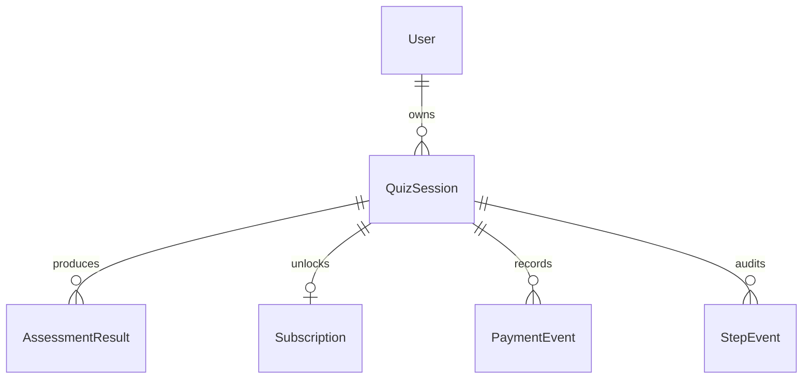

# 数据库设计

## 设计目标

HealthGate 的数据库不是只为了存一张表单，而是要支撑题面关心的后端能力：

- 分步保存和进度恢复。
- 核心字段强校验和可查询。
- 完整 submit 后生成可审计的评估结果。
- 修改核心输入后让旧结果失效。
- `/pay` 幂等回调和订阅权限。
- 自动化测试可以验证并发、幂等、异常路径。

## 表关系



核心判断：

- 一个匿名用户可以有多个测评 session。
- 一个 session 可以有多个历史 assessment result，但同一时间只有一个 current result。
- 一个 session 最多有一个当前 subscription 状态。
- 一个 session 可以有多个 payment event，用于证明 `/pay` 幂等和回调历史。
- 一个 session 可以有多个 step event，用于证明分步保存、重复提交、乱序和并发路径。

## 表设计

### User

用途：

- 承载匿名用户。
- 后续如果接入登录，可以把匿名 session 迁移到真实 user。

关键字段：

| 字段 | 说明 |
| --- | --- |
| `id` | UUID 主键 |
| `anonymousKey` | 匿名浏览器/设备标识，可为空且唯一 |
| `createdAt`, `updatedAt` | 审计时间 |

说明：

- 第一版不做注册登录。
- `anonymousKey` 只是恢复体验辅助，不是安全鉴权凭证。
- 评审 cURL 仍以显式 `sessionId` 为准。

### QuizSession

用途：

- 测评主表。
- 存储 session 状态、并发 version、当前 step、核心计算字段和扩展答案。

关键字段：

| 字段 | 说明 |
| --- | --- |
| `status` | `DRAFT` / `COMPLETED` |
| `version` | 乐观并发控制，每次成功 PATCH +1 |
| `currentStep` | 后端 API step，使用 enum |
| `completedSteps` | 已完成 API step，JSON 数组 |
| `answersJson` | 扩展答案，如 ageRange、currentBodyShape、sleepHours |
| `gender`, `goalType`, `activityLevel`, `exerciseFrequency` | 核心枚举字段 |
| `age`, `heightCm`, `currentWeightKg`, `targetWeightKg` | 核心数值字段 |
| `bodyZones`, `physicalLimitations` | JSON 数组 |
| `healthDataConsent`, `healthDataConsentAt` | 健康数据同意及时间 |
| `completedAt` | submit 成功时间 |

为什么核心枚举用 DB enum：

- 能防止绕过 API 时写入任意字符串。
- Prisma Client 类型更清晰。
- 测试数据工厂能复用枚举，不靠散落字符串。

为什么不是所有问卷答案都建列：

- 竞品 funnel 中有大量展示型/动机型问题。
- 这些问题会经常变化，不应频繁迁移 schema。
- 只有影响算法、权限或恢复的字段才列化。

### AssessmentResult

用途：

- 存储服务端计算后的派生结果。
- 支撑 preview/full 差异化返回。
- 支撑算法版本和输入版本审计。

关键字段：

| 字段 | 说明 |
| --- | --- |
| `sessionId` | 所属 session |
| `sourceSessionVersion` | 生成结果时的 session version |
| `algorithmVersion` | 生成结果时的算法版本 |
| `status` | `CURRENT` / `STALE` |
| `bmi`, `bmr`, `tdee`, `recommendedCalories` | 计算结果 |
| `goalDirection`, `weeklyDeltaKg`, `targetDate` | 目标预测 |
| `publicSummary`, `publicRecommendations` | preview 可见字段 |
| `caloriePlan`, `projectionCurve` | full-only 字段 |
| `invalidatedAt` | 结果失效时间 |

关键约束：

```txt
@@unique([sessionId, sourceSessionVersion])
@@index([sessionId, status])
```

设计理由：

- 重复 submit 同一 session version 时返回同一个 result，不重复创建。
- 核心字段修改后，旧 result 标记为 `STALE`，新 submit 创建新 result。
- 评审如果追问“为什么历史结果还解释得通”，可以用 `algorithmVersion + sourceSessionVersion` 回答。

注意：

- Prisma 不能直接表达“同一个 session 只有一个 CURRENT result”的 PostgreSQL partial unique index。
- 第一版在 service transaction 中保证：创建新 current result 前，把同 session 旧 current result 标记为 stale。
- 如果后续需要更强 DB 约束，可以添加手写 SQL migration partial unique index。

### Subscription

用途：

- 表示当前 session 是否有完整结果访问权限。

关键字段：

| 字段 | 说明 |
| --- | --- |
| `sessionId` | 唯一，一个 session 最多一个 subscription 状态 |
| `status` | `ACTIVE` / `EXPIRED` / `CANCELED` |
| `activeFrom`, `activeUntil` | 权限时间范围 |

设计理由：

- 未支付状态不一定需要一行 subscription；没有 active subscription 即 API 返回 `subscriptionStatus=none`。
- 订阅状态不放入 `answersJson`，也不放入 `assessment_results`。
- 支付成功只改变访问权限，不修改问卷答案，也不重新计算 result。

### PaymentEvent

用途：

- 记录 `/pay` 模拟回调。
- 支撑幂等重放和冲突检测。

关键字段：

| 字段 | 说明 |
| --- | --- |
| `sessionId` | 关联 session |
| `provider` | 第一版为 `mock` |
| `idempotencyKey` | 幂等 key |
| `status` | `SUCCEEDED` / `FAILED` |
| `payload` | 原始模拟回调 payload |

关键约束：

```txt
@@unique([provider, idempotencyKey])
@@index([sessionId])
```

设计理由：

- 同 provider 下 idempotencyKey 唯一。
- 同 key + 同 session + 同 status：返回已有 payment event。
- 同 key + 不同 session 或不同 status：返回 `409 IDEMPOTENCY_CONFLICT`。
- 将来如果接真实 provider，不同 provider 可以有各自 key 空间。

### StepEvent

用途：

- 审计每一次分步保存。
- 支撑“重复提交、乱序、并发更新”测试证据。

关键字段：

| 字段 | 说明 |
| --- | --- |
| `sessionId` | 关联 session |
| `stepKey` | API step enum |
| `versionBefore`, `versionAfter` | 保存前后版本 |
| `payload` | 当次提交内容 |
| `createdAt` | 提交时间 |

关键索引：

```txt
@@index([sessionId, stepKey])
@@index([sessionId, createdAt])
```

设计理由：

- 不只保存最终答案，也保留用户操作历史。
- 并发冲突时，只有成功写入的请求产生 StepEvent。
- 评审可以通过测试证明后端不是“前端点一下看起来能用”。

## Result Stale 策略

核心字段包括：

```txt
gender
goalType
bodyZones
age
heightCm
currentWeightKg
targetWeightKg
activityLevel
exerciseFrequency
healthDataConsent
```

当 `COMPLETED` session 的核心字段被修改：

1. `quiz_sessions.status` 回到 `DRAFT`。
2. 当前 `assessment_results.status` 改为 `STALE`。
3. `assessment_results.invalidatedAt` 写入当前时间。
4. `GET result` 在重新 submit 前返回 `409 RESULT_NOT_READY`。
5. 重新 submit 后创建新的 `AssessmentResult(CURRENT)`。

当只修改扩展字段：

- session version 递增。
- 记录 StepEvent。
- 不强制 stale 当前 result。
- 结果页文案如需更新，由后续重新读取 session/result 决定。

## 并发控制

`QuizSession.version` 是乐观锁：

```txt
PATCH step expectedVersion = current version -> success, version + 1
PATCH step expectedVersion != current version -> 409 VERSION_CONFLICT
```

数据库实现建议：

- 在事务中用 `where: { id, version: expectedVersion }` 更新 session。
- 如果更新数量为 0，返回 `VERSION_CONFLICT`。
- 同事务写入 StepEvent。

这样并发测试可以证明不会出现静默覆盖。

## 重要索引与约束

| 表 | 约束 / 索引 | 目的 |
| --- | --- | --- |
| `users` | `anonymousKey @unique` | 匿名用户恢复 |
| `quiz_sessions` | `@@index([userId])` | 查询某用户 session |
| `quiz_sessions` | `@@index([status])` | 查询 draft/completed |
| `quiz_sessions` | `@@index([flowTopic, status])` | demo/运营查询 |
| `assessment_results` | `@@unique([sessionId, sourceSessionVersion])` | submit 幂等 |
| `assessment_results` | `@@index([sessionId, status])` | 查询 current result |
| `subscriptions` | `sessionId @unique` | 每个 session 一个当前订阅状态 |
| `payment_events` | `@@unique([provider, idempotencyKey])` | 支付幂等 |
| `payment_events` | `@@index([sessionId])` | 查询支付历史 |
| `step_events` | `@@index([sessionId, stepKey])` | 查询 step 历史 |
| `step_events` | `@@index([sessionId, createdAt])` | 审计时间线 |

## 当前审阅中修正的问题

| 问题 | 风险 | 修正 |
| --- | --- | --- |
| `AssessmentResult` 缺少 `algorithmVersion` | 历史结果无法解释算法版本 | 已加入 `algorithmVersion` |
| `AssessmentResult.sessionId @unique` | 无法保留历史结果和 stale 记录 | 改为一对多，增加 `sourceSessionVersion/status/invalidatedAt` |
| 核心枚举字段用 string | DB 层无法防止非法枚举 | 改为 Prisma enum |
| `PaymentEvent.idempotencyKey @unique` | 未来多 provider key 空间不清楚 | 改为 `@@unique([provider, idempotencyKey])` |
| `StepEvent.stepKey` 用 string | 审计事件可能写入非法 step | 改为 `QuizStepKey` enum |
| 健康数据同意只有 boolean | 无法说明同意发生时间 | 增加 `healthDataConsentAt` |

## 与测试的关系

数据库设计直接支撑以下测试：

- `version` + `expectedVersion`：并发更新测试。
- `StepEvent`：重复提交、乱序保存审计。
- `AssessmentResult.sourceSessionVersion`：重复 submit 幂等。
- `AssessmentResult.status`：核心字段修改后 result stale。
- `PaymentEvent(provider, idempotencyKey)`：支付幂等和冲突。
- `Subscription.status`：preview/full 权限差异。

## 暂不做的数据库能力

第一版不做：

- 真实登录用户表扩展。
- 真实支付订单表。
- subscription renewal/refund 明细。
- PostgreSQL partial unique index 强制一个 session 只有一个 current result。
- 长期数据归档和软删除。

这些不属于题面核心。README 中可说明第一版通过 service transaction 保证 current result 唯一，后续可用手写 migration 增强 DB 约束。
