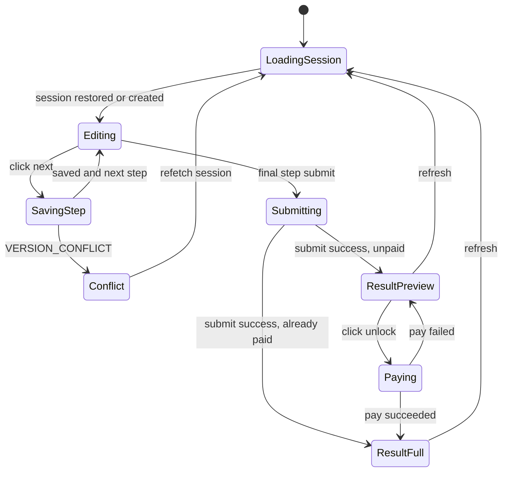

# 前端 Funnel 体验设计

## 结论

HealthGate 前端采用 **单页分步 funnel + 独立结果页**：

- `/`：测评入口和分步问卷主体。
- `/result?sessionId=...`：结果页，根据订阅状态展示 preview 或 full。
- `POST /pay`：结果页上的模拟支付动作，成功后刷新结果。

这不是为了省事，而是由竞品调研和本题评分重点共同决定：

- 竞品 URL 使用 `order=<uuid>` 贯穿问卷，说明匿名 session-first 模型适合这类产品。
- 竞品先问目标、体型、习惯等低压力问题，再进入身高体重等敏感数据，说明前端不应做成一个冷冰冰的短表单。
- 竞品响应中 `answers.required` 与 `extra/contentAnswers` 分离，说明前端也应区分“算法核心字段”和“个性化展示字段”。
- 竞品有 `paidOrder` / `paidUpsellOrders` 和 order status 线索，说明结果页应明确区分未支付预览和支付后完整结果。
- 本题重点是后端工程质量，因此前端要服务于分步保存、恢复、权限差异和线上演示，而不是做复杂页面架构。

## 为什么不选其他形态

### 不选短表单

短表单实现最快，但不符合调研结果。

竞品页面流程证明，健康测评类产品依赖“逐步承诺”：

1. 先让用户回答容易点击的问题。
2. 再收集更敏感的身体数据。
3. 最后给出有吸引力的结果预览和付费解锁。

如果 HealthGate 直接把性别、年龄、身高、体重、目标体重放在一个表单里，会削弱“真实用户愿意一路填到付费弹窗”的交付要求，也无法体现我们对竞品数据流的理解。

### 不选多路由问卷

多路由如 `/quiz/profile`、`/quiz/goal`、`/quiz/body` 结构更像大型产品，但第一版不推荐。

原因：

- 本题 3 天交付，重点是后端和测试。
- 多路由会增加恢复、跳转、版本冲突、E2E 路径维护成本。
- 单页 stepper 同样可以做到刷新恢复和中断恢复，因为真实状态在后端 session，而不是依赖前端路由。

### 不选营销页优先

不做传统 landing page 作为第一屏。

原因：

- 题目要求公网可完整演示 funnel。
- 评审打开链接后应立刻进入可操作测评，而不是先读营销内容。
- 品牌感可以通过问卷首屏、进度、文案和结果页建立，不需要单独消耗一个营销页。

## 页面结构

```txt
/
  单页分步 funnel
  - 首次打开 create-or-resume session
  - 每一步 Next 时 PATCH 保存
  - URL 保留 sessionId
  - 刷新时 GET session 恢复

/result?sessionId=...
  结果页
  - GET result
  - preview 显示公开字段 + paywall
  - 点击模拟支付 -> POST /pay
  - 支付后重新 GET result，展示 full
```

## Funnel 步骤设计

前端步骤按“低压力个性化 -> 核心身体数据 -> 生活习惯 -> 结果”的节奏组织。

| UI 步骤 | 用户看到的问题 | API step | 产生数据 | 持久化位置 | 设计理由 |
| --- | --- | --- | --- | --- | --- |
| 1. 基础画像 | 你的性别？大致年龄段？当前体型更接近哪种？ | `profile` | `gender`, `ageRange`, `currentBodyShape` | `gender` 核心列；其余进 `answersJson.extra` | 低压力开场，建立个性化感 |
| 2. 目标 | 你最想改善什么？ | `goal` | `goalType` | 核心列 | 影响目标方向、结果文案和算法解释 |
| 3. 关注区域 | 哪些部位最想改善？ | `goal` | `bodyZones[]`, `desiredBodyShape` | `bodyZones` JSON 列；体型目标进 `answersJson.extra` | 对应竞品 `bodyZones` 数据流 |
| 4. 身体数据 | 年龄、身高、当前体重、目标体重 | `body` | `age`, `heightCm`, `currentWeightKg`, `targetWeightKg` | 核心列 | 算法必需字段，必须强校验 |
| 5. 健康数据同意 | 同意用于生成非医学建议 | `body` | `healthDataConsent` | 核心列 | 对应竞品身高页 consent 观察 |
| 6. 活动水平 | 日常活动量、运动频率 | `activity` | `activityLevel`, `exerciseFrequency`, `typicalDay` | 前两项核心列；`typicalDay` 进 extra | TDEE 必需输入 |
| 7. 生活习惯 | 睡眠、饮水、饮食偏好、身体限制 | `habits` | `sleepHours`, `waterIntake`, `dietPreference`, `physicalLimitations` | extra + limitations JSON | 增强结果解释，不伪装成医学输入 |
| 8. 生成结果 | 提交并等待计算 | `submit` | 无新增答案 | `assessment_results` | 服务端生成 BMI、热量、目标日期 |

说明：

- UI 可以把 `goal` step 拆成两个视觉步骤，后端仍保存到同一个 `goal` API step。`goal` PATCH 允许先提交 `goalType`，再提交 `bodyZones` 和 `desiredBodyShape`。
- UI 可以把 `body` step 拆成“身体数据”和“健康数据同意”两个视觉步骤，后端仍保存到同一个 `body` API step。`body` PATCH 允许先提交年龄/身高/体重，再提交 `healthDataConsent`。
- 这样既保留竞品 funnel 节奏，又避免 API 被前端展示细节拖碎。

## 状态恢复

### 首次打开

1. 前端调用 `POST /api/sessions`，默认 `resumeExisting=true`。
2. 后端返回 `sessionId` 和 `version`。
3. 前端把 URL 更新为 `/?sessionId=...`。
4. 后端同时设置 `hg_session_id` cookie。
5. 如果用户点击“重新开始”，前端传 `resumeExisting=false` 创建新 session。

### 页面刷新

1. 前端优先读取 URL 中的 `sessionId`。
2. 如果 URL 没有，调用 `POST /api/sessions`，由后端基于 HttpOnly cookie 返回现有 session 或创建新 session。
3. 如果 URL 有 `sessionId`，调用 `GET /api/sessions/:sessionId`。
4. 用 `currentStep`、`completedSteps` 和 `answers` 恢复 UI。
5. 如果 session `status=completed` 且 result 有效，直接跳转 `/result?sessionId=...`；只有用户点击“修改答案”时才回到 funnel。

### 中途关闭后再次进入

如果评审或用户保留了 URL，显式 `sessionId` 可以跨浏览器恢复。cookie 只是用户体验增强，不是 README 演示的依赖。

### API step 到视觉 step 的恢复

API 的 `currentStep` 是后端 step，不等于前端视觉步骤。前端恢复时应根据答案完整度推导视觉位置：

| 条件 | 恢复到视觉步骤 |
| --- | --- |
| `profile` 字段不完整 | 1. 基础画像 |
| profile 完整，但没有 `goalType` | 2. 目标 |
| 有 `goalType`，但 `bodyZones` 或 `desiredBodyShape` 不完整 | 3. 关注区域 |
| 有 `bodyZones`，身体核心字段不完整 | 4. 身体数据 |
| 身体核心字段完整，`healthDataConsent` 不是 true | 5. 健康数据同意 |
| consent 已同意，`activity` 字段不完整 | 6. 活动水平 |
| activity 完整，`habits` 字段不完整 | 7. 生活习惯 |
| funnel 完成字段完整 | 8. 生成结果 |

这样可以解决“8 个视觉步骤映射到 5 个 API step”的恢复问题，也能让评审刷新页面后停在符合直觉的位置。

其中 `habits` 不参与第一版健康算法，但仍作为 funnel 完成字段处理；`physicalLimitations` 可以是空数组，表示用户确认没有限制。

如果 session 已经 `completed` 且结果未失效，优先进入结果页，而不是停留在第 8 步。第 8 步只用于“字段已完整但还没有生成当前有效 result”的状态。

### 版本冲突

如果 `PATCH` 返回 `409 VERSION_CONFLICT`：

1. 前端重新 `GET /api/sessions/:sessionId`。
2. 用后端最新答案覆盖本地状态。
3. 提示“检测到页面已更新，请确认后继续”。

第一版不做复杂合并，因为本题要证明冲突可控，而不是实现协同编辑。

## 表单交互原则

### 低压力问题用卡片选择

用于：

- 性别
- 年龄段
- 当前体型
- 目标
- 关注区域
- 活动水平
- 运动频率
- 睡眠/饮水/饮食偏好

原因：

- 符合竞品点击式 funnel 的观察。
- 移动端输入成本低。
- 数据天然适合枚举校验。

### 敏感身体数据用明确输入控件

用于：

- 精确年龄
- 身高
- 当前体重
- 目标体重

要求：

- 前端展示范围提示，但最终以后端 Zod 校验为准。
- 身高提示 `90-243 cm`。
- 体重提示 `24.9-300 kg`。
- 目标体重不合理时展示后端返回的原因。

### 进度展示

使用轻量进度条和 `第 3 / 8 步` 形式，不做复杂动画。

目标：

- 给用户确定感。
- 给评审清晰路径。
- 方便 E2E 测试定位。

### 导航与重新开始

- 提供“上一步”，允许用户返回修改已保存答案。
- 如果用户在结果生成后返回修改核心字段，前端应提示“修改后需要重新生成结果”，并跳回 funnel。
- 提供弱化的“重新开始”入口，调用 `POST /api/sessions` 且 `resumeExisting=false`。
- 浏览器前进/后退不作为主要状态来源；前端始终以后端 session 和本地 visual step 为准。

### 加载与错误状态

前端必须显式处理这些状态：

| 状态 | UI 行为 |
| --- | --- |
| 创建/恢复 session 中 | 显示轻量加载状态，不展示空问卷 |
| 保存 step 中 | Next 按钮 loading，避免重复点击 |
| `400 VALIDATION_ERROR` | 当前步骤显示字段错误或边界提示 |
| `409 VERSION_CONFLICT` | 重新拉取 session，提示用户确认最新答案 |
| `422 INCOMPLETE_SESSION` | 根据缺失字段跳回对应视觉步骤 |
| `409 RESULT_NOT_READY` | 引导回到第 8 步重新 submit |
| 网络错误 | 保留当前草稿，允许重试 |

## 结果页设计

结果页是前端最关键的转化页，也是权限裁剪的展示面。

### 结果页状态

结果页至少处理 5 种状态：

| 状态 | 来源 | UI 行为 |
| --- | --- | --- |
| loading | 正在 `GET result` | 展示轻量加载，不渲染旧结果 |
| result not ready | `409 RESULT_NOT_READY` | 提示结果需要重新生成，按钮回到第 8 步 |
| preview | `access=preview` | 展示公开结果 + 解锁区域 |
| paying | 正在 `POST /pay` | 主 CTA loading，避免重复点击 |
| full | `access=full` | 展示完整计划 |

结果页不维护自己的“真假会员”状态，始终以 `GET /api/sessions/:sessionId/result` 返回的 `access` 为准。

### 未支付 preview

调用：

```txt
GET /api/sessions/:sessionId/result
```

当 `access=preview` 时展示：

- BMI 数值和分类。
- `publicSummary`。
- `publicRecommendations`。
- 一个清晰的解锁区域。

推荐信息层级：

1. 顶部显示“你的初步评估已生成”，让用户知道前面的输入产生了结果。
2. 第一屏给出 BMI、分类和一句公开建议。
3. 下方展示 2-3 条公开建议，强调安全、稳定、可持续。
4. 解锁区域说明订阅后能看到完整计划。
5. 主按钮为“解锁完整计划”。

不能展示：

- `bmr`
- `tdee`
- `recommendedCalories`
- `goalDirection`
- `weeklyDeltaKg`
- `targetDate`
- `caloriePlan`
- `projectionCurve`

前端也不应该写死这些 protected 字段的占位值。非会员拿不到什么，由 API 响应决定。

preview 可以展示“完整计划包含哪些模块”的用户价值，但不能展示受保护字段 key 或具体数值。可以写“目标日期与趋势曲线”，但不能在 JSON 或页面调试信息里暴露 `targetDate` / `projectionCurve` 字段，也不能前端编造日期或曲线点。

### 付费 CTA

按钮文案建议：

```txt
解锁完整计划
```

点击后调用：

```txt
POST /pay
```

请求体：

```json
{
  "sessionId": "...",
  "idempotencyKey": "ui-<sessionId>-succeeded-v1",
  "status": "succeeded"
}
```

为了演示方便，按钮旁边可以有一个次要按钮：

```txt
模拟失败支付
```

它调用同一个 `/pay`，但 `status=failed`，用于证明失败支付不激活订阅。

失败支付使用独立 idempotencyKey，例如：

```json
{
  "sessionId": "...",
  "idempotencyKey": "ui-<sessionId>-failed-demo-v1",
  "status": "failed"
}
```

不能让失败支付和成功支付复用同一个 idempotencyKey，否则第二次调用会按幂等冲突处理。

支付交互：

- 成功支付后立即重新调用 `GET result`，不在前端手动拼 full 数据。
- 失败支付后留在 preview，并展示“模拟支付失败，订阅未激活”。
- 如果 `/pay` 返回 `409 IDEMPOTENCY_CONFLICT`，展示“支付请求已被不同状态使用，请刷新后重试”，并重新拉取 result。
- 如果用户已经付费，再次进入结果页直接显示 full，不再展示 paywall。

### 已支付 full

当 `access=full` 时展示：

- BMI 和分类。
- 公开摘要和公开建议。
- BMR/TDEE。
- 建议每日摄入量。
- 目标预测日期。
- 简化版热量计划。
- projection curve，可用列表或轻量折线图。

第一版不必做复杂图表库。为了降低实现风险，可以先用 CSS/HTML 做一条轻量趋势线或表格；如果时间允许再加图表。

推荐信息层级：

| 区块 | 展示内容 | 目的 |
| --- | --- | --- |
| 总览 | BMI、分类、公开摘要、目标方向、目标日期 | 第一眼知道自己处于什么状态、要多久 |
| 每日建议 | `recommendedCalories`、蛋白质、水分 | 体现服务端计算价值 |
| 活动解释 | TDEE、运动频率解释 | 让活动输入和结果建立联系 |
| 趋势 | `projectionCurve` 的简化折线或周表 | 展示会员解锁差异 |
| 安全提示 | 基于 `physicalLimitations` 的非医学提醒 | 体现扩展答案的作用 |

技术术语处理：

- 可以显示 `BMR` / `TDEE`，但要附中文说明，例如“基础代谢估算（BMR）”。
- 不把所有数值塞进同一个卡片；优先按“总览、每日建议、趋势、安全提示”分区。
- `algorithmVersion` 可放在折叠详情或页脚，方便评审看到结果可审计，但不打扰普通用户。

### Preview 的展示边界

preview 可以展示“完整计划包含哪些模块”的商业价值，但不能展示受保护字段名和伪造数值。

推荐展示：

- “你的基础趋势已经生成”
- “订阅后查看完整每日计划”
- “订阅后查看目标日期和趋势曲线”
- “订阅后查看个性化饮食与运动建议”

避免展示：

- `BMR`
- `TDEE`
- `recommendedCalories`
- 任何前端假造的目标日期或曲线点

### 修改答案入口

结果页提供次要入口：

```txt
修改答案
```

行为：

- 点击后回到 funnel，并恢复到第一个可编辑核心步骤。
- 用户修改核心字段后，旧 result 失效，前端提示“修改后需要重新生成结果”。
- 如果只修改生活习惯等扩展字段，可以继续使用当前 result，但文案更新以重新获取 session/result 为准。

### 评审辅助信息

结果页底部可以提供一个很轻的“演示信息”折叠区：

- `sessionId`
- `resultId`
- `subscriptionStatus`
- `algorithmVersion`

这些不是面向普通用户的主要内容，但能帮助评审快速确认支付前后访问权限确实变化。

## 前端视觉策略

目标是“可信、轻量、愿意继续”，不是营销页炫技。

建议风格：

- 中文主文案。
- 大面积留白。
- 温和但不单色的配色，避免整页只是一种蓝紫/绿色渐变。
- 卡片选择保持 8px 左右圆角。
- 输入页比选择页更克制，强调安全和边界。
- 结果页用清晰数据层级，不堆装饰。
- 移动端优先，桌面端限制内容宽度，避免问卷像后台表单。
- 第一屏直接进入测评问题，不做营销 hero。

避免：

- 一上来放大段品牌宣传。
- 大量动画或复杂转场。
- 把核心结果只做成前端假数据。
- 用前端隐藏字段冒充权限控制。

## API 对接策略

前端只做薄状态管理：

- 本地保存当前 UI step 和表单草稿。
- 每次点击下一步调用对应 API 保存。
- 后端成功后用返回的 `version` 更新本地状态。
- 页面刷新或错误恢复时以后端 `GET session` 为准。
- submit 后跳转 `/result?sessionId=...`。

建议封装一个轻量 API client：

```txt
src/lib/api-client.ts
  createSession()
  restoreSession(sessionId)
  saveStep(sessionId, stepKey, expectedVersion, answers)
  submitSession(sessionId, expectedVersion)
  getResult(sessionId)
  pay(sessionId, status)
```

API client 只处理 HTTP，不写业务判断。字段映射和校验规则仍以后端 schema 为准。

### 前端配置

建议把视觉步骤配置化，但不要做动态问卷平台：

```txt
src/features/funnel/steps.ts
  visualStepId
  title
  subtitle
  apiStepKey
  fields
  nextButtonLabel
```

这样新增展示型问题时只需要改 step config、API schema 和 `answersJson.extra` 映射，不会把页面写成一大坨条件判断。

## 前端状态机



## 与测试计划的关系

前端 E2E 只覆盖最小关键路径：

1. 打开 `/`。
2. 创建 session。
3. 完成全部 funnel。
4. submit 后进入 `/result?sessionId=...`。
5. 未支付看到 preview。
6. 点击 `解锁完整计划`。
7. 支付后看到 full。
8. 刷新后仍是 full。

再补一个中断恢复 E2E：

1. 打开 `/`。
2. 完成前 3 个视觉步骤。
3. 刷新页面。
4. 确认已选答案仍在，且恢复到第 4 步。

边界、非法输入、幂等冲突和权限字段泄漏主要由 API/集成测试覆盖。前端 E2E 不承担所有后端边界测试，否则 3 天内维护成本过高。

## 最终前端决策

采用：

```txt
单页分步 funnel + 独立结果页 + 结果页模拟支付
```

这能同时满足：

- 竞品调研得出的产品节奏。
- 题目要求的分步保存和恢复。
- 评审需要的公网完整演示。
- 后端为主、前端不糊弄的交付平衡。
