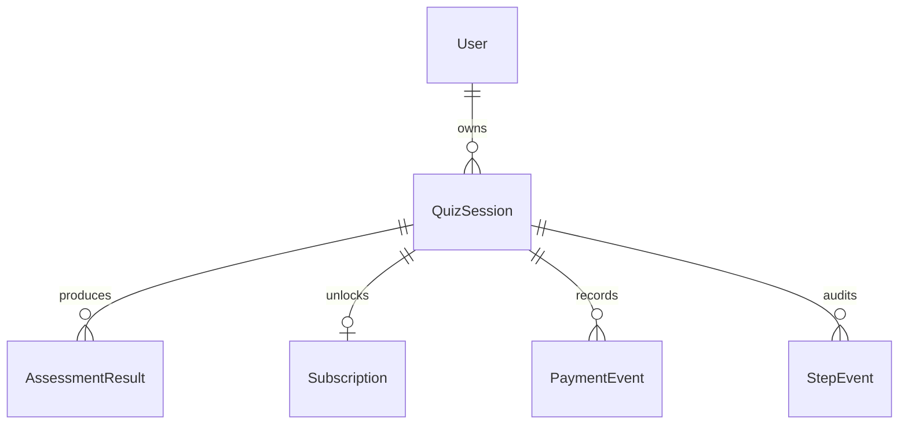

# README 交付结构

## 目标

最终 README 是评审最可能直接打开的文档。它应该回答四个问题：

1. 线上在哪里体验？
2. 本地怎么跑起来？
3. 自动化测试覆盖了什么，怎么一键运行？
4. 如何验证 preview -> `/pay` -> full result？

README 不应只写安装命令，也不应把所有设计细节堆进去。详细设计放到 `docs/`，README 负责导航和交付证明。

## 编写原则

- 顶部先给评审最需要的信息：Live URL、GitHub URL、CI 状态、demo sessionId。
- 每个“已完成”声明都要能被命令、链接、测试或线上行为验证。
- 部署前允许保留占位符，但必须标记为 `待部署后补入`，不能让评审误以为已经上线。
- cURL 示例必须完整可复制，不使用 `...` 省略关键请求。
- README 只放交付摘要，复杂取舍链接到 `docs/`，避免评审在首页迷路。
- 测试说明要同时写“覆盖了什么”和“暂不覆盖什么”，避免看起来只是在堆工具名。

## 推荐结构

```txt
# HealthGate

## Live Demo
## Reviewer Quick Path
## What This Project Demonstrates
## Tech Stack
## Architecture Summary
## Data Model
## API Quick Reference
## Local Setup
## Environment Variables
## Database Migration
## Demo Seed
## Test & Quality
## CI
## Deployment
## Known Non-goals
## AI Collaboration Review
## Documentation Index
```

## 1. Live Demo

必须放在 README 顶部。

内容：

```txt
Live URL: https://...
GitHub Repo: https://github.com/77652189/healthGate
CI Status: badge
```

还要列出：

```txt
UNPAID_DEMO_SESSION_ID=<uuid>
PAID_DEMO_SESSION_ID=<uuid>
```

目的：

- 评审不用先读一堆设计文档。
- 可以直接在线跑完整 funnel。
- 可以直接对比 preview/full。

部署前占位写法：

```md
> 当前状态：实现/部署前。Live URL、CI badge、demo sessionId 会在部署完成后补入。
```

部署后必须移除这句占位提示，改为真实链接和真实 sessionId。

## 2. Reviewer Quick Path

给评审一条最快路径：

```txt
1. 打开 Live URL。
2. 完成 8 步健康测评。
3. 查看未支付 preview。
4. 点击“解锁完整计划”模拟支付。
5. 查看 full result。
```

还要给 API 复现路径：

```bash
BASE_URL="https://..."
SESSION_ID="<uuid>"

curl "$BASE_URL/api/sessions/$SESSION_ID/result"

curl -X POST "$BASE_URL/pay" \
  -H "Content-Type: application/json" \
  -d '{"sessionId":"'$SESSION_ID'","idempotencyKey":"review-demo-001","status":"succeeded"}'

curl "$BASE_URL/api/sessions/$SESSION_ID/result"
```

同时提供完整 API 重放脚本，证明不用浏览器也能验证后端闭环：

```bash
BASE_URL="https://<vercel-domain>"

curl -X POST "$BASE_URL/api/sessions" \
  -H "Content-Type: application/json" \
  -d '{"flowTopic":"healthgate_weight_management_v1","resumeExisting":false}'

SESSION_ID="<created-session-id>"

curl -X PATCH "$BASE_URL/api/sessions/$SESSION_ID/steps/profile" \
  -H "Content-Type: application/json" \
  -d '{"expectedVersion":1,"answers":{"gender":"female","ageRange":"30_39","currentBodyShape":"mid_sized"}}'

curl -X PATCH "$BASE_URL/api/sessions/$SESSION_ID/steps/goal" \
  -H "Content-Type: application/json" \
  -d '{"expectedVersion":2,"answers":{"goalType":"lose_weight","bodyZones":["belly","legs"],"desiredBodyShape":"toned"}}'

curl -X PATCH "$BASE_URL/api/sessions/$SESSION_ID/steps/body" \
  -H "Content-Type: application/json" \
  -d '{"expectedVersion":3,"answers":{"age":32,"heightCm":168,"currentWeightKg":74,"targetWeightKg":65,"healthDataConsent":true}}'

curl -X PATCH "$BASE_URL/api/sessions/$SESSION_ID/steps/activity" \
  -H "Content-Type: application/json" \
  -d '{"expectedVersion":4,"answers":{"activityLevel":"moderate","exerciseFrequency":"3_4_week","typicalDay":"active_breaks"}}'

curl -X PATCH "$BASE_URL/api/sessions/$SESSION_ID/steps/habits" \
  -H "Content-Type: application/json" \
  -d '{"expectedVersion":5,"answers":{"sleepHours":"7_8","waterIntake":"medium","dietPreference":"traditional","physicalLimitations":[]}}'

curl -X POST "$BASE_URL/api/sessions/$SESSION_ID/submit" \
  -H "Content-Type: application/json" \
  -d '{"expectedVersion":6}'

curl "$BASE_URL/api/sessions/$SESSION_ID/result"

curl -X POST "$BASE_URL/pay" \
  -H "Content-Type: application/json" \
  -d '{"sessionId":"'$SESSION_ID'","idempotencyKey":"review-demo-001","status":"succeeded"}'

curl "$BASE_URL/api/sessions/$SESSION_ID/result"
```

README 应明确写出预期结果：

- 支付前：`access=preview`，响应中不含 protected fields。
- 支付后：`access=full`，同一个 session 返回完整字段。

## 3. What This Project Demonstrates

用短 bullet 对齐题面评分点：

- API design：REST route、统一错误结构、Zod validation。
- Persistence：step-by-step save、restore、version conflict。
- Core logic：BMI、BMR/TDEE、recommended calories、target date。
- Auth/access：preview vs full result，protected fields 不泄漏。
- Payment callback：`/pay` 幂等、subscription 激活。
- Quality：unit/integration/E2E/CI。
- AI collaboration：调研、建模、测试边界、方案否决。

## 4. Tech Stack

列出：

```txt
Next.js App Router
TypeScript
Prisma
Supabase PostgreSQL
Zod
Vitest
Playwright
GitHub Actions
Vercel
```

说明 Supabase 选择理由：

- 题面明确要求 Supabase / Prisma + PostgreSQL。
- Prisma 负责 schema、migration、类型安全。
- CI 不连接线上 Supabase，使用 PostgreSQL service。

## 5. Architecture Summary

README 只放简版：

```txt
Browser -> Next.js Pages -> Route Handlers -> Domain Services -> Prisma -> PostgreSQL
```

并链接：

- [架构设计](./architecture.md)
- [数据库设计](./database-design.md)
- [API 设计](./api-design.md)

## 6. Data Model

README 放 Mermaid 简版 ER 图：



并说明：

- 核心字段列化。
- 扩展答案进 `answersJson`。
- 结果历史可审计，`CURRENT/STALE`。
- 支付权限独立于问卷答案。

## 7. API Quick Reference

列一个表：

| Method | Path | Purpose |
| --- | --- | --- |
| POST | `/api/sessions` | create-or-resume session |
| GET | `/api/sessions/:sessionId` | restore progress |
| PATCH | `/api/sessions/:sessionId/steps/:stepKey` | save step |
| POST | `/api/sessions/:sessionId/submit` | generate assessment |
| GET | `/api/sessions/:sessionId/result` | preview/full result |
| POST | `/pay` | mock payment callback |
| GET | `/api/health` | health check |

必须强调：

- 主支付接口是 `POST /pay`。
- README cURL 使用 `/pay`，不是 `/api/pay`。

## 8. Local Setup

结构：

```bash
npm ci
cp .env.example .env
npm run prisma:generate
npx prisma migrate dev
npm run dev
```

访问：

```txt
http://localhost:3000
```

## 9. Environment Variables

```txt
DATABASE_URL=
DIRECT_URL=
NEXT_PUBLIC_APP_URL=
```

说明本地、CI、production 三种环境。

## 10. Database Migration

写清楚：

```bash
npx prisma migrate dev
npx prisma migrate deploy
```

并说明：

- migration 文件随仓库提交。
- production 不在 build 时自动创建 migration。
- CI 使用 PostgreSQL service。

## 11. Demo Seed

实现后 README 写：

```bash
npm run seed:demo
```

输出：

```txt
UNPAID_DEMO_SESSION_ID=...
PAID_DEMO_SESSION_ID=...
```

说明 demo seed 幂等，可重复执行。

## 12. Test & Quality

README 必须写：

```bash
npm test
npm run test:e2e
npm run test:ci
```

测试覆盖说明：

- Algorithm unit tests。
- Validation boundary tests。
- Step save/restore integration tests。
- Concurrency/version conflict tests。
- Access control field trimming tests。
- `/pay` idempotency tests。
- E2E preview -> pay -> full。

链接：

- [自动化测试策略](./testing-strategy.md)
- [测试要求可追踪矩阵](./test-requirements-traceability.md)

还要写明暂不覆盖：

- 不做真实支付网关测试。
- 不做医学诊断准确性验证。
- 不做大规模性能压测。
- 不做像素级视觉回归测试。

原因：本挑战核心是后端骨架、数据持久化、权限闭环和关键路径质量证明。

## 13. CI

README 放 badge：

```md

```

说明：

- GitHub Actions 使用 PostgreSQL service。
- 不连接线上 Supabase。
- 最新一次通过状态可点击查看。

## 14. Deployment

写清：

- Vercel public URL。
- Supabase PostgreSQL。
- `prisma migrate deploy`。
- `npm run seed:demo`。
- production migration 和 demo seed 通过手动触发的 GitHub Actions `production-maintenance` workflow 执行。

链接：

- [公网部署策略](./deployment-strategy.md)

## 15. Known Non-goals

必须说明暂不覆盖内容：

- 真实支付网关。
- 用户注册登录。
- 医学级诊断。
- 长期订阅续费/退款。
- 动态问卷 CMS。
- 多语言。

说明原因：3 天挑战聚焦后端骨架、数据建模、权限闭环和测试质量。

## 16. AI Collaboration Review

README 简短摘要，详细内容链接到：

- [AI 协作复盘](./ai-collaboration-review.md)

必须包含：

- AI 如何辅助竞品调研。
- AI 如何辅助 Schema/API/测试边界。
- AI 哪次建议被否决，为什么。

## 17. Documentation Index

列出所有 docs：

- 竞品调研
- 架构设计
- API 设计
- 数据库设计
- 前端 Funnel 体验设计
- 公网部署策略
- 验收标准与测试计划
- 自动化测试策略
- 测试要求可追踪矩阵
- AI 协作复盘
- 实现路线图

## README 交付核对表

最终提交前逐项检查：

| 检查项 | 必须满足 |
| --- | --- |
| Live URL | 公网可打开，能从首页走到结果页 |
| GitHub URL | 指向 public repo |
| CI badge | 指向最新 GitHub Actions workflow |
| Demo sessionId | 未支付和已支付两个都能访问 |
| `/pay` cURL | 可复制执行，支付后同 session 从 preview 变 full |
| 测试命令 | `npm test` / `npm run test:e2e` / `npm run test:ci` 说明清楚 |
| Schema 图 | README 有 Mermaid 简图，详细设计链接到 docs |
| AI 复盘 | 有摘要，有完整文档链接，有被否决方案 |
| Known non-goals | 明确说明不做真实支付、医学诊断等范围 |
| 占位符 | 部署后不得保留 `<uuid>`、`https://...`、`待补` 等未替换内容 |

## 当前 README 待补项

| 项 | 当前状态 |
| --- | --- |
| Live URL | 待部署后补 |
| CI badge | 待 workflow 建成后补 |
| demo sessionId | 待 seed 实现并部署后补 |
| `/pay` 完整 cURL | API 已设计，待实现后验证 |
| 测试覆盖结果 | 测试实现后补 |
| AI 复盘最终版 | 初稿已设计，最终实现后更新 |

## README 完成标准

最终 README 达标条件：

- 评审能 5 分钟内找到线上 URL、GitHub、测试命令、`/pay` cURL。
- 能明确看到测试覆盖范围和暂不覆盖原因。
- 能直接复制 cURL 验证 preview -> full。
- 能看到 CI badge 或最新通过状态。
- 能找到数据库 Schema 图和 AI 复盘。
